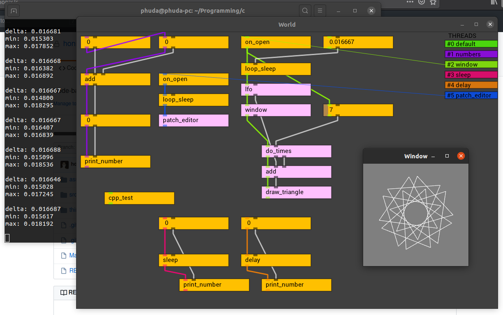

# covil - C Operated VIsual Language



### slogan
lets bring power and flexibility to visual programming world

### status
work in progress, early prototype

developed and tested to work on linux (latest Ubuntu), but will be easy to port on windows and other platforms

### docs
- [Node](docs/Node.md) - basic information on nodes
- [Patch editor](docs/Patch%20editor.md) - patch editor controlls
- [System](docs/System.md) - advanced information, new nodes programming

### dependencies to run from sources

- common deps: ```make, gcc```
- patch editor deps: ```libglfw3-dev``` (> 3.3.0)

thirdparty libs:
- nanovg deps: ```premake4```

### build and run
clone with submodiles:
```
git clone --recurse-submodules git@github.com:honix/c.git
```
run this commands in project root folder:
```
make
make run
```

### todo (topmost is priority)
- messaging over threads using signals?
- multi-selection and panning in patch editor
- save load patches (maybe using non-c high-level language)
- maybe loop.h (scheduler) will be dropped after (loop works in main thread, and oply helpful on delayed node execution when opening patch (see on_open node))
- patch_editor custom user nodes (inputboxes, buttons, graphs and etc)
- rethink node creation API from C
- better, systematic error logging
- try to plugin big drawing/sound engines like ogre, try run both in same time
- patch_editor *.so objects is too big, they staticly linked with nanovg
- thirdparty libraries auto-wrap? (use header files to generate node functions)

### strange ideas
- lua or janet or python interpreter as node, can be used as command line; such interpreter can be used as patch file definition using interpreter syntax
- pin nodes to the screen space, and use them as part of ui
